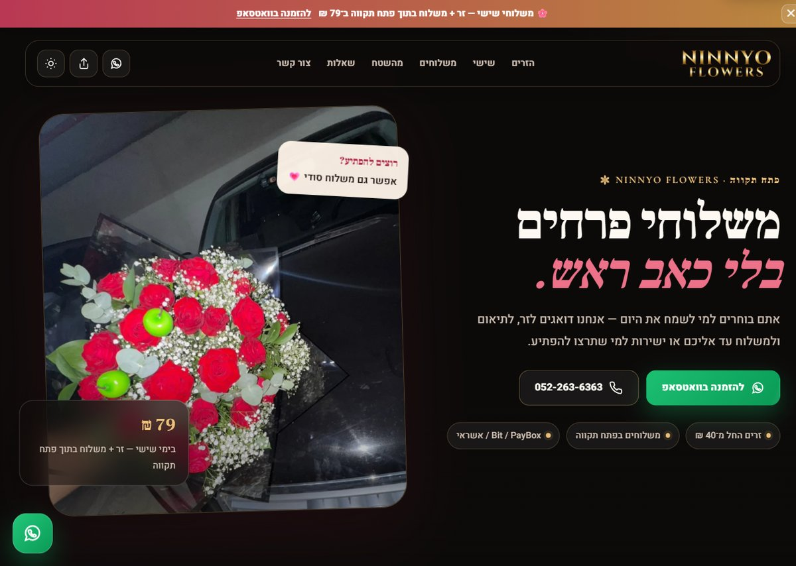
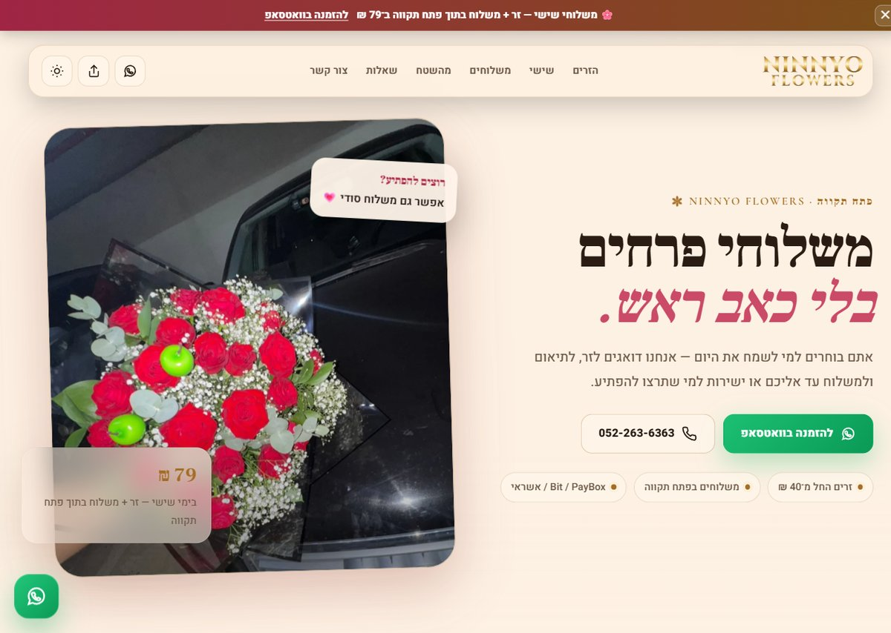
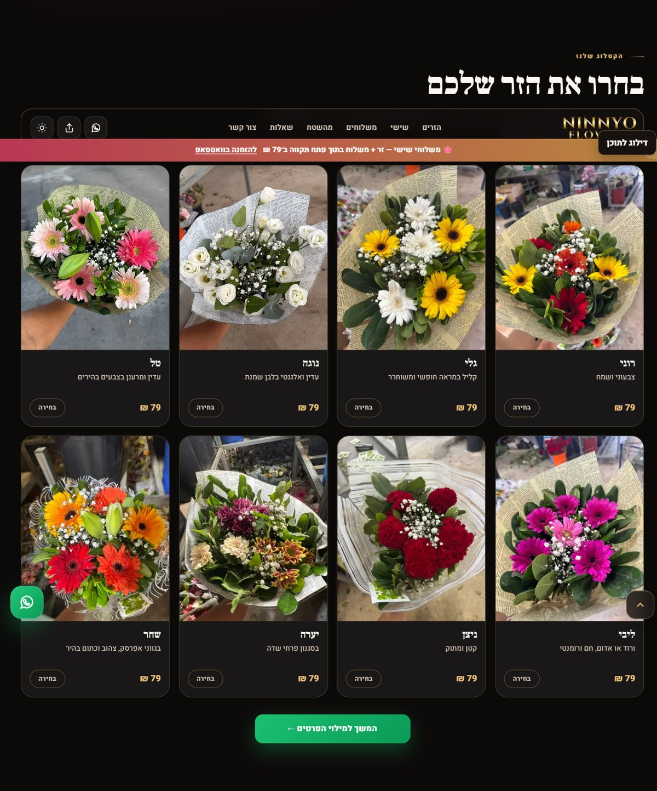
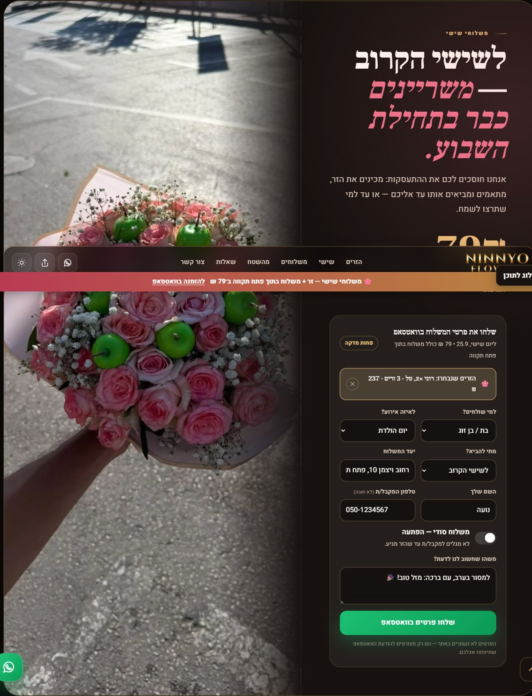
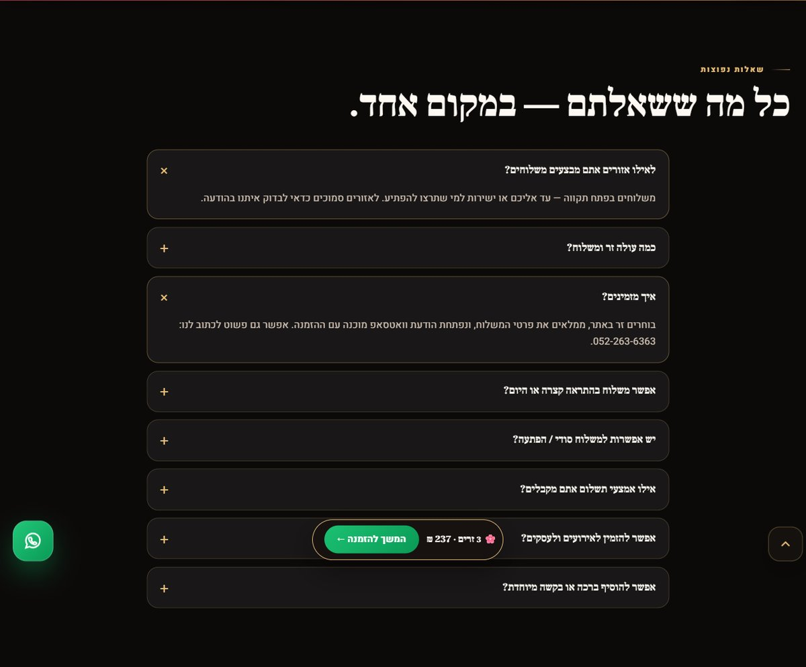
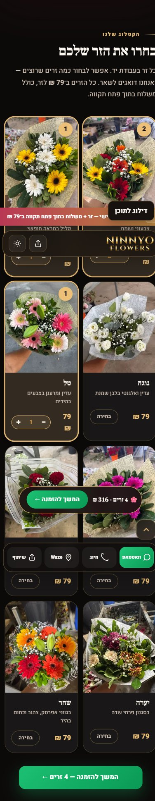

# NINNYO FLOWERS — production landing page

Static Hebrew RTL landing page for a Petah Tikva florist, ready for Vercel.
Ordering runs entirely through a pre-filled **WhatsApp** message — no backend.

**Live:** https://ninnyo.vercel.app/

## Screenshots

| Home — dark | Home — light |
| --- | --- |
|  |  |

| Bouquet picker | Order form |
| --- | --- |
|  |  |

| FAQ | Mobile |
| --- | --- |
|  |  |

## What's on the page

- **Brand logo** — ornate gold *NINNYO FLOWERS* wordmark used across the header, the social share card, and the app / home-screen icons (`ninnyo-flowers-logo.png`, `header-wordmark.png`).
- **Hero** — brand + location kicker, headline, quick contact, and the Friday delivery offer (79 ₪ incl. delivery inside Petah Tikva).
- **Bouquet picker (`#pick`)** — 8 hand-named bouquets at 79 ₪ each (רוני / גלי / נוגה / טל / ליבי / ניצן / יערה / שחר). **Multi-select cart** with per-bouquet quantity steppers, a live summary chip, a "המשך להזמנה" button, and a **sticky mini-cart** that follows while browsing. The whole selection is itemized (per-item + total) into the WhatsApp order.
- **Rich order form** — recipient, occasion, timing, destination, sender name, recipient phone, secret-surprise toggle, and notes — all folded into **one** pre-filled WhatsApp message to the shop.
- **Delivery types**, real "from the field" photo gallery, and reasons-to-send.
- **FAQ (`#faq`)** — accordion of common questions (areas, pricing, timing, payment, events).
- **Contact / follow & review / location** — WhatsApp, call, Waze, Maps, Instagram, TikTok, email.

## Included / tech

- Mobile-first responsive layout
- Dark / Light theme (remembers the visitor's choice)
- Editorial-botanical type system (Frank Ruhl Libre + Heebo + Cormorant Garamond, Hebrew-first)
- WhatsApp ordering flow — form data is never stored
- Native Share button (`navigator.share`) with copy-link fallback
- Floating Back-to-top arrow, sticky mobile action bar, sticky mini-cart
- Responsive images (`srcset`/`sizes` with thumbnails) + explicit dimensions to avoid layout shift
- Preloaded hero image and preconnected fonts for a fast first paint
- SEO: canonical URL, Open Graph / Twitter cards, and `Florist` + `ItemList` (bouquet products) + `FAQPage` JSON-LD structured data
- Branded share image served by `api/og.js` (see below)
- Accessibility: skip-to-content link, visible focus states, reduced-motion support
- No backend; order form data is not stored

## Local preview

Open `index.html` directly, or serve the folder:

```bash
python3 -m http.server 8000   # then visit http://localhost:8000
```

## Deploy to Vercel

1. Upload the **contents of this folder** to a GitHub repository. `index.html` must be at the repository root.
2. In Vercel choose **Add New → Project**.
3. Import the repository.
4. Framework Preset: **Other**.
5. Build Command: leave empty.
6. Output Directory: leave empty or use `.`.
7. Click **Deploy**.

After deployment, the Share button will share the public Vercel URL automatically.

## Share previews (WhatsApp / social)

Link previews use the Open Graph tags in `index.html`, whose `og:image` points
to `https://ninnyo.vercel.app/api/og` — a tiny serverless function
(`api/og.js`) that returns the branded card (`og-image.jpg`) with a clean
`HTTP 200`.

Why a function instead of the static `og-image.jpg`: Vercel's CDN adds HTTP
Range support to static files, so crawlers that send a `Range` header (Facebook,
and especially WhatsApp) get a `206 Partial Content` response — which WhatsApp
rejects for preview images, so the logo never renders. The function ignores
Range and always returns `200`. The raw card is still available at
`/og-image.jpg` for direct/manual use.

If you move to a custom domain, update the `og:image`, `og:url`, `canonical`
and JSON-LD `url` values to match. WhatsApp/Facebook cache previews
aggressively — after a change, re-scrape in the
[Facebook Sharing Debugger](https://developers.facebook.com/tools/debug/)
(twice — the first scrape only queues the image), and for WhatsApp share the
URL once with a query suffix (e.g. `?v=2`) to bypass its cache.
